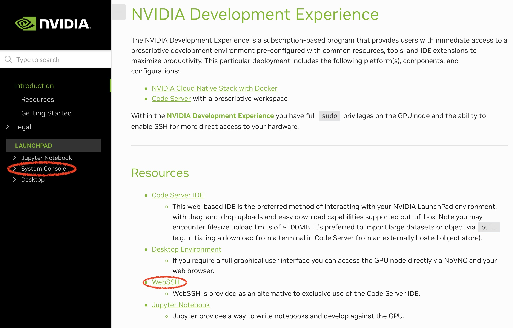
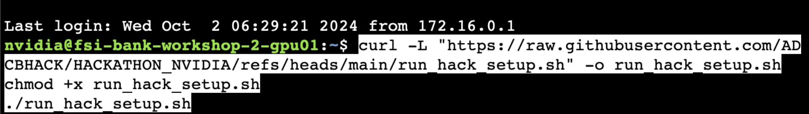
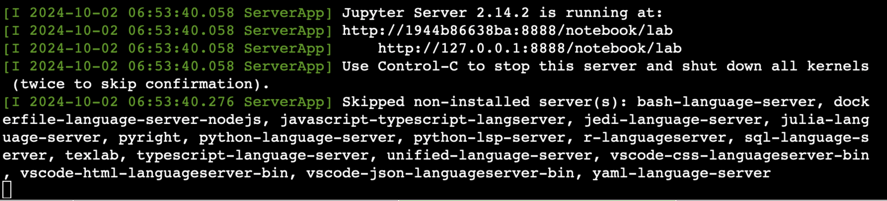
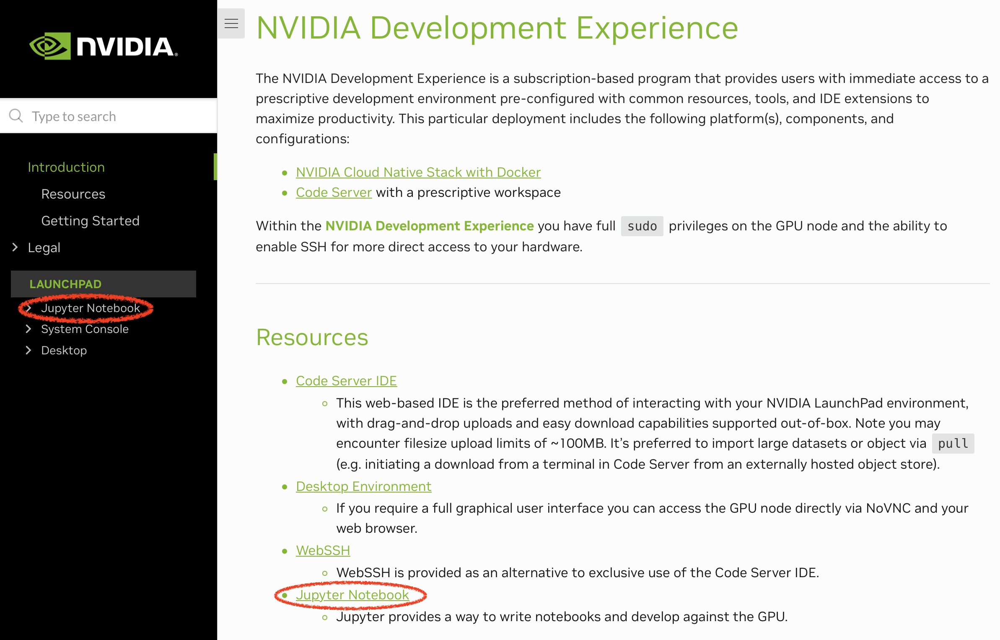

# Instructions
## Accessing LaunchPad

Using the link shared on MS Teams for your particular team, open up the Nvidia LaunchPad login page:


After logging in, click Get Started:


## Initializing the Environment
### This part is for one member of the team to run at the start. 
Open up the Console, by either clicking on WebSSH or System Console



Copy the code below:
```
curl -L "https://raw.githubusercontent.com/ADCBHACK/HACKATHON_NVIDIA/refs/heads/main/run_hack_setup.sh" -o run_hack_setup.sh
chmod +x run_hack_setup.sh
./run_hack_setup.sh
```

And paste it into the console:



When it has finished downloading, the Jupyter Notebook server will be ready



---

## Accessing Jupyter Notebooks
### Once the environment has been set up, any member of the team can access the coding environment

Open a new window to LaunchPad. From here, click on Jupyter Notebook as below:




